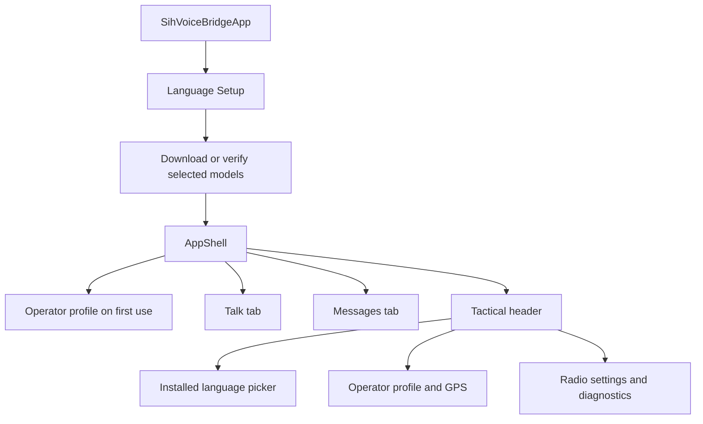

# iTantra UI map and user flows

The main UI comes from [pull request #2](https://github.com/Shreeyanshjanu/offline-multilingual-transceiver/pull/2), commit `7278890418295f1535ce7db82eb5da442727b594`. It is integrated with the existing Android model downloader and speech pipeline.

## Startup and navigation

[app.dart](../lib/app/app.dart) first displays language choices with English selected. Users choose at most two languages. Android DownloadManager handles sequential model transfers; setup restores pending work and verifies each model and tokenizer before creating the main controller. See [setup validation](setup-validation.md) for download lifecycle details.

[AppShell](../lib/app/ui/app_shell.dart) contains the Talk and Messages tabs, persistent header, and bottom navigation. A saved operator profile is loaded after the language setup step. First-time operator setup collects a callsign, role, squad, and location-sharing preference.

## Talk

[TalkScreen](../lib/app/ui/screens/talk_screen.dart) provides:

- Host and join controls for TCP communication on port 7070.
- Optional Wi-Fi gateway detection to populate the leader address. Discovering an address does not establish a connection; the user still taps Connect.
- A waiting-for-peers state with a working Disconnect action while the host is listening.
- Walkie-talkie and continuous capture modes, model loading feedback, transcript preview, and the emergency message action.

The native pipeline remains lazy. Model metadata is resolved on its worker thread. Recording is blocked during language switches, and delayed events from previously selected languages cannot clear the current loading state.

The screen composes widgets under [`widgets/talk/`](../lib/app/ui/widgets/talk/):
`TeamMeshCard` owns the host address and gateway lookup state; `MeshRoleSelector`
renders host/join selection; `TalkModeSwitcher`, `TalkPttStation`,
`TransmissionMonitor`, and `EmergencySosBar` render the remaining controls.
PTT press, release, cancel, and hands-free callbacks still delegate to the same
controller methods.

## Messages

[MessagesScreen](../lib/app/ui/screens/messages_screen.dart) displays incoming and outgoing messages, sender identity, optional GPS metadata, presets, text composition, and history controls. Existing TCP relay and UTF-8 frame handling are preserved. SOS presets use the selected language. Location sharing applies to both structured coordinates and coordinates embedded in SOS text.

[`DispatchMessageCard`](../lib/app/ui/widgets/messages/dispatch_message_card.dart)
renders each dispatch. [`MessageComposer`](../lib/app/ui/widgets/messages/message_composer.dart)
owns the draft text controller and preset actions.

## Header and sheets

- [TacticalHeader](../lib/app/ui/widgets/tactical_header.dart) opens language, profile, and radio controls.
- [LanguagePickerSheet](../lib/app/ui/widgets/language_picker_sheet.dart) offers only installed languages supplied by the setup flow.
- [OperatorProfileSheet](../lib/app/ui/widgets/operator_profile_sheet.dart) saves identity locally and exposes GPS refresh. Android location permission is requested when saving a profile with sharing enabled or explicitly refreshing GPS. Denying permission does not block text or voice communication. Profile save failures leave the form open for retry.
- [RadioSettingsSheet](../lib/app/ui/widgets/radio_settings_sheet.dart) reads and changes actual Android media volume. Emergency Voice Volume Boost controls whether incoming SOS speech temporarily raises that volume; it does not synthesize a siren. The switch lasts for the current app session. The sheet also shows live model and benchmark data and exports recorded benchmark JSON or CSV.
- [ModelStatusBadge](../lib/app/ui/widgets/model_status_badge.dart) shows model information and loading feedback; its header wraps at narrow widths and larger text scales.

Profile field and GPS presentation live under [`widgets/profile/`](../lib/app/ui/widgets/profile/).
The profile sheet retains validation, permission requests, and save state.
Radio cards live under [`widgets/settings/`](../lib/app/ui/widgets/settings/):
operator details, audio controls, speech models, and benchmark export. The radio
sheet listens to controller changes; its audio card owns slider state and native
volume reads/writes.

## State and platform boundary

[`AppController`](../lib/app/state/app_controller.dart) remains the public
application API. Private extensions in the same Dart library separate native
event handling, message dispatch, and benchmark recording. State ownership,
native bridge ownership, and disposal remain in the controller.

[`NativeBridgeService`](../lib/app/services/native_bridge_service.dart) manages
channel initialization, speech commands, event subscriptions, and disposal.
Device and download methods are private mixins under `services/native_bridge/`,
so they remain overridable instance methods. Event types live in
`models/native_event.dart` and are re-exported by the service for existing callers.
On Android, `ModelDownloadChannelHandler` handles download requests independently
of lazy voice pipeline creation. Channel names, arguments, error handling, model
storage paths, and initialization order are unchanged.

## Integration and verification

The PR's broad TTS replacement and release shrinking changes were not needed for the UI integration. Existing speech backends, absolute model paths, download services, model manifests, and manifest-only asset packaging are retained. The subsequent cleanup removed 16 legacy Flutter screens/widgets unreachable from the app and its tests, plus the unused native `ConnectionManager` placeholder. The active shell uses the radio sheet for settings.

Automated coverage includes startup and downloads, installed-language filtering, host disconnect before peers join, stale and failed language-switch events, profile and GPS payloads, radio layout, narrow screens, larger text, native speech behavior, and TCP relay. Acoustic recognition, Android permission interaction, and real multi-device communication require device testing.

Validation on 2026-09-17: all 67 Flutter tests and 9 Kotlin pipeline tests passed;
Flutter analysis reported no issues and the debug APK built successfully. The
update was installed on the moto g85 5G without clearing its app data. The Talk,
Messages, profile, and radio sheets were visually checked. The installed-language
picker offered only English and Hindi; both recognizers loaded successfully when
switching languages, and English was restored afterward. No microphone recording
or message transmission was performed during this UI check. GPS permission and
location acquisition were not exercised. Screenshots and app logs are in the
local generated `build/verification/` directory.

The integration is local; no GitHub merge, push, or comment was made. The original
working files are backed up in `.git/codex-ui-pr2-20260917-155745/before/`, with a
manifest recording which paths were new.

## Code organization cleanup validation

The subsequent cleanup on 2026-09-17 removed 17 unused source files containing
3,733 lines, three unused private reflection helpers, and the unused direct
`path_provider` declaration. That package remains available transitively for
Google Fonts; dependency versions were not changed.

| Main file | Before | After |
| --- | ---: | ---: |
| `talk_screen.dart` | 1,005 | 56 |
| `messages_screen.dart` | 588 | 113 |
| `radio_settings_sheet.dart` | 720 | 161 |
| `operator_profile_sheet.dart` | 521 | 268 |
| `app_controller.dart` | 923 | 528 |
| `native_bridge_service.dart` | 530 | 225 |
| `NativeBridgeHandler.kt` | 490 | 326 |
| `SttEngine.kt` | 1,203 | 146 |
| `TtsEngine.kt` | 677 | 129 |

Counts are lines in each main file; active implementations were extracted into
the components described above. Snapshot comparison confirmed unchanged bodies
for the retained STT/TTS declarations, moved controller logic, native channel
methods, and core Talk/Message widgets, allowing the visibility and qualification
changes needed for extraction. Every remaining Flutter source file is reachable
from the application or its tests.

All 67 Flutter tests and 9 Kotlin pipeline tests passed after the refactor, and
Flutter analysis was clean. The final debug APK built successfully and contains
zero ONNX entries. Existing Gradle/Kotlin deprecation warnings and the test-only
Google Fonts network warning remain.

The APK was installed as an update on the moto g85 5G. Startup, Talk, Messages,
radio settings, the radio-to-profile edit action, and English → Hindi → English
model loading were checked. The existing profile loaded, and model/tokenizer
sizes and timestamps matched before and after the update. No profile was saved,
message sent, or microphone capture started by this verification. Live acoustic
recognition and two-device communication were not retested. Device screenshots
and logs are in `build/verification/refactor-*`.

The local branch is `refactor/code-organization-20260917`. The source snapshot,
refactor-only diff, and audit report are kept under
`.git/codex-refactor-20260917-163433/`. This cleanup improves code organization;
runtime speed and APK-size improvements have not been measured.
