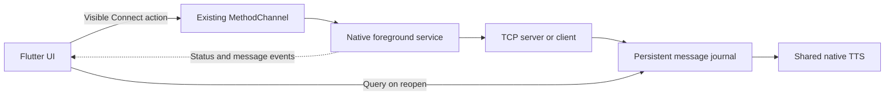

# Persistent background connection

Implemented for iTantra Voice Bridge, package `com.sih.voicebridge`. Validation date: 17 September 2026.

## Using the feature

Open Talk → Radio diagnostics and settings → Background Connection. Enable **Keep Connection Active in Background**, then use **Start Leader Mesh** or **Connect to Leader** in Talk. Enabling the setting while a foreground connection is active transfers ownership to the native service. The switch alone, while disconnected, does not connect.

Talk displays the connection state and **BACKGROUND ACTIVE**. A leader with no peers displays **LISTENING**; this does not imply a connected peer. Turning the switch off stops the connection. Its description explains this before the user changes it. Press Connect afterward to use the existing Flutter foreground connection.

## Ownership and lifecycle



Background OFF preserves `TcpMessageService`. Background ON closes and awaits Dart's sockets before starting native ownership. Flutter initialization and resume only query status/history; neither starts a service nor opens a second socket.

| Action | Behavior |
| --- | --- |
| Visible Connect | Save configuration and a new generation, then call `ContextCompat.startForegroundService`. |
| Service starts | Immediately call `ServiceCompat.startForeground`, then start network work on executors. |
| Home / activity disposal | Service, sockets, persistence, and TTS continue independently of Flutter. STT/microphone resources are released when the activity pipeline is disposed. |
| Swipe this app from Recents | `stopWithTask=false`; `onTaskRemoved` logs the event and leaves the requested connection active. |
| Reopen | Restore actual native status, configuration, language, and saved messages. Do not reconnect or replay stored messages. |
| Disconnect in UI or notification | Invalidate saved connection intent and generation, close sockets, cancel retries, remove foreground notification, stop service. |
| Switch OFF | Save disabled/disconnected state and stop native ownership. No automatic handback to a live Dart socket. |
| Unexpected system service recreation | `START_STICKY` permits recreation. A null start intent is accepted only when both saved enabled/requested flags are true. |
| Android Active Apps Stop | Android stops the whole app without service callbacks. No scheduled job, receiver, or alarm attempts to undo this. Reopening queries state and waits for another Connect. |
| Force Stop | Respect Android's stopped-package behavior. Opening the app later does not reconnect by itself. |
| Reboot | No recovery receiver or boot-start behavior is implemented. |

Android does not guarantee process survival, a sticky restart, uninterrupted Wi-Fi, or delivery during Doze. Manufacturer battery restrictions can also stop/delay the service. The battery help button opens this app's settings; the user chooses battery behavior. No battery-exemption permission is added.

## Cancellation and reconnects

Network reads, writes, connects, and persistent journal writes do not run on the Android main thread. Socket failures use delays of **1, 2, 4, 8, 15, then 30 seconds**, capped at 30 seconds; successful attachment resets the sequence. Connect attempts have a 5-second timeout. Wi-Fi network callbacks prompt controlled transport reconnection without polling. A server restarts its listener after listener/network failure; a departed peer simply leaves the server listening for others.

Transport epochs reject old socket attempts. Persisted connection generations reject stale service-start intents. Status revisions prevent late query responses overwriting newer events. Disconnect cleanup executes even if saving the preference fails; the API reports the persistence failure. A successful disconnect persists `connection_requested=false`, so an old host address alone cannot revive the service.

This is the existing TCP delivery model: no offline outbound queue, delivery acknowledgement, or application heartbeat was added. Silent black holes are detected by Android network callbacks or TCP failure/keepalive, which may take time. Outgoing UI messages can report send failure when no peer is available.

## Protocol, persistence, and TTS

The service retains port **7070** and newline-delimited UTF-8 `SpeechMessage` JSON, including ID, type, language, timestamp, sender metadata, and optional GPS metadata. Malformed UTF-8, invalid fields, and frames over 64 KiB are rejected. A host supports up to 16 peers, relays accepted messages to the other peers, and does not echo to the sending socket. The service is unexported and exposes no Binder.

The existing persisted benchmark data is not a complete independent background-message store. A small native SharedPreferences journal therefore stores messages before playback. It keeps at most **200 records / 512 KiB** and a separate recent **1,000-ID** deduplication window. It stores read state, origin, reception time, and playback timestamps/errors. Clearing history retains deduplication IDs. Once an ID ages out of the bounded window, global lifetime deduplication is not guaranteed.

Preferences in `itantra_connection` include `background_connection_enabled`, `connection_requested`, `run_as_server`, `host`, `port`, `last_known_connection_state`, `generation`, `language_code`, `messages`, and `seen_ids`. Actual running status comes from the live service rather than the last saved label.

Reception, storage, relay, and native speech work without an EventChannel listener. `SharedSpeechOutput` reference-counts the existing native `TtsEngine` between the visible pipeline and service, preserving emergency volume behavior. Android TTS selects an installed offline voice and reports unavailable voices gracefully; no online TTS dependency is introduced. The existing fallback-to-English behavior remains when a language is unsupported. Incoming message language determines playback language, as before.

Flutter loads saved records by ID, updates the history and benchmark timestamps, and acknowledges visible messages. It never speaks the restored records. Persistent deduplication prevents repeated packets from being stored, relayed, or spoken again within the retention window. Playback is attempted after storage: a process death between these steps can leave a stored message that was not spoken. History remains available; automatic replay is deliberately avoided to prevent duplicate speech.

## Existing channel API

MethodChannel: `com.sih.voicebridge/native`. EventChannel: `com.sih.voicebridge/native_events`.

| Method | Purpose |
| --- | --- |
| `setBackgroundConnectionEnabled` | Save the user preference; OFF also disconnects. |
| `startBackgroundConnection` | Visible action with `runAsServer`, `host`, `port`, `languageCode`. |
| `stopBackgroundConnection` | Persist cancellation and stop ownership. |
| `getBackgroundConnectionStatus` | Query actual running/connected/state, configuration, generation/revision, unread count, notification permission. |
| `sendBackgroundMessage` | Send an existing wire-format message through native ownership. |
| `getBackgroundMessages` | Retrieve bounded history, including playback/read metadata. |
| `acknowledgeBackgroundMessages` | Mark listed message IDs read. |
| `clearBackgroundMessages` | Clear journal records, retaining recent deduplication IDs. |
| `requestConnectionNotifications` | User-driven Android 13+ notification request. |
| `openConnectionBatterySettings` | Open this app's settings for user-controlled battery configuration. |

Events include `connection_state`, `incoming_message`, `connection_error`, and existing TTS/audio events. They synchronize a live UI; they are not required for service operation.

## Manifest and Gradle

Added only these permissions for this feature:

```xml
<uses-permission android:name="android.permission.FOREGROUND_SERVICE" />
<uses-permission android:name="android.permission.FOREGROUND_SERVICE_REMOTE_MESSAGING" />
<uses-permission android:name="android.permission.POST_NOTIFICATIONS" />
```

```xml
<service
    android:name=".connection.ConnectionForegroundService"
    android:exported="false"
    android:foregroundServiceType="remoteMessaging"
    android:stopWithTask="false" />
```

No Gradle dependencies or SDK settings changed. Existing AndroidX core 1.13.1 supports the foreground-service APIs. This workspace resolves Flutter's compileSdk/targetSdk to **36**, with minSdk **24** and Java/Kotlin target **17**.

The notification channel is `itantra_background_connection`, notification ID 7070. Its content opens iTantra and its Disconnect action stops the service. It shows connection state without transcripts or message contents. Android 13+ notification denial does not block starting the service; the UI explains that Active Apps still shows it. Permission completion waits until the activity resumes so Connect remains a visible action after the permission dialog.

## Build and automated validation

PowerShell, from the project root:

```powershell
flutter analyze --no-pub
flutter test --no-pub --reporter expanded
$env:JAVA_HOME = 'C:\Program Files\Android\Android Studio1\jbr'
& "$env:JAVA_HOME\bin\java.exe" '-Dorg.gradle.appname=gradlew' `
  -classpath '.\android\gradle\wrapper\gradle-wrapper.jar' `
  org.gradle.wrapper.GradleWrapperMain -p android `
  :app:testDebugUnitTest :app:assembleDebug :app:assembleDebugAndroidTest `
  --offline --console=plain
```

The offline Gradle command uses this machine's populated cache. On a new development machine, install the Flutter/Android prerequisites and run dependency resolution first. A normal Flutter build is also supported: `flutter build apk --debug`.

```powershell
$adb = 'C:\Users\arthu\AppData\Local\Android\sdk\platform-tools\adb.exe'
$device = 'ZA222MVV6T' # Replace with the test device's adb serial.
& $adb -s $device install -r build/app/outputs/apk/debug/app-debug.apk
& $adb -s $device shell am start -n com.sih.voicebridge/.MainActivity
# Or: flutter run -d $device

& $adb -s $device install -r build/app/outputs/apk/androidTest/debug/app-debug-androidTest.apk
& $adb -s $device shell am instrument -w `
  -e class com.sih.voicebridge.connection.BackgroundConnectionDeviceTest `
  com.sih.voicebridge.test/androidx.test.runner.AndroidJUnitRunner
```

`BackgroundConnectionDeviceTest` uses an isolated preferences namespace. It does not reset real app data or run microphone/STT capture tests. The lifecycle test below is explicitly restricted to disposable emulators and refuses to interrupt an already-requested connection:

```powershell
& $adb -s emulator-5562 shell input keyevent 224
& $adb -s emulator-5562 shell pm grant com.sih.voicebridge android.permission.RECORD_AUDIO
& $adb -s emulator-5562 shell pm grant com.sih.voicebridge android.permission.POST_NOTIFICATIONS
& $adb -s emulator-5562 shell am instrument -w `
  -e allowServiceLifecycle true `
  -e class com.sih.voicebridge.connection.BackgroundServiceLifecycleTest `
  com.sih.voicebridge.test/androidx.test.runner.AndroidJUnitRunner
```

## Manual device verification commands

Start/stop connections through the visible app. Do not expose the service just to launch it from adb. External `am startservice` cannot legitimately access this unexported component.

Test a phone acting as leader using two controlled computer peers:

```powershell
& $adb -s $device forward tcp:17070 tcp:7070
python -u tools/background_connection_peer.py --connect 127.0.0.1 --port 17070 --peers 2
```

The helper accepts `send <test label>`, `repeat`, `status`, `drop`, and `quit`. It prints message IDs, not message contents. Press Home, send again, remove only iTantra's card from Recents, then send again. Reopen and inspect connected status/history; `repeat` must not create another relay/history record/playback. For a lock-screen test, lock manually and unlock normally; do not bypass a device lock.

Test the phone as a client, choosing `127.0.0.1` in Join Squad:

```powershell
& $adb -s $device reverse tcp:7070 tcp:17071
python -u tools/background_connection_peer.py --listen --port 17071
```

Use `drop` to verify reconnect. Close the helper to exercise capped retries; Disconnect must cancel them. ADB forwarding validates TCP/service behavior, not physical Wi-Fi availability. To validate Wi-Fi, use another device as leader on the same test LAN, turn the client's Wi-Fi off/on, and inspect reconnect logs. Do not infer that result from loopback tests.

```powershell
& $adb -s $device shell dumpsys activity services com.sih.voicebridge
& $adb -s $device logcat -d -s BG_SERVICE:I
& $adb -s $device shell dumpsys package com.sih.voicebridge |
  Select-String 'POST_NOTIFICATIONS: granted'
```

Expected Android 14+ service type: `0x00000200` (`remoteMessaging`). Logs omit message contents.

On a test device, notification denial can be reproduced without relying on dialog coordinates:

```powershell
& $adb -s $device shell pm revoke com.sih.voicebridge android.permission.POST_NOTIFICATIONS
& $adb -s $device shell pm set-permission-flags com.sih.voicebridge android.permission.POST_NOTIFICATIONS user-set user-fixed
# Reopen, press Connect, and confirm granted=false plus a running foreground service.
# Restore the test device's previous permission state; for a previously granted permission:
& $adb -s $device shell pm clear-permission-flags com.sih.voicebridge android.permission.POST_NOTIFICATIONS user-fixed
& $adb -s $device shell pm grant com.sih.voicebridge android.permission.POST_NOTIFICATIONS
```

Android's documented Active Apps Stop equivalent:

```powershell
& $adb -s $device shell cmd activity stop-app com.sih.voicebridge
& $adb -s $device shell dumpsys activity services com.sih.voicebridge
& $adb -s $device shell am start -n com.sih.voicebridge/.MainActivity
# Confirm history restoration and no automatic connection.
```

Force Stop is a separate test: `& $adb -s $device shell am force-stop com.sih.voicebridge`. Do not reboot for this iteration. Remove only test forwarding rules afterward:

```powershell
& $adb -s $device forward --remove tcp:17070
& $adb -s $device reverse --remove tcp:7070
```

## Results and version limits

Final verification results are recorded in [background-validation.md](background-validation.md). Automated regressions: **75 Flutter tests**, **13 Kotlin unit tests**, analyzer clean, debug app and instrumentation APK builds successful. These include existing STT/pipeline, model-management, UI, protocol, benchmark, GPS, and new ownership/cancellation tests; they do not substitute for a full physical microphone/voice/language audit.

| Android | Implementation consideration | Runtime coverage |
| --- | --- | --- |
| 12 / API 31 | Foreground service starts must follow a visible action. | No installed device/image available; not runtime verified. |
| 13 / API 33 | Notification permission and Active Apps Stop. | No API 33 device/image; equivalent behavior exercised on API 36. |
| 14 / API 34 | Type-specific permission and `remoteMessaging` service type. | Existing desktop emulator; see validation report. |
| 15 / API 35 | `dataSync`/`mediaProcessing` timeout changes do not apply to this service type. | No API 35 device/image available; not runtime verified. |
| 16 / API 36 | Current foreground-service rules; job quotas do not turn executor-owned sockets into jobs. | Moto g85 5G; see validation report. |

Doze/OEM restrictions still apply across these versions. An API 36 success does not prove API 31/33/35 behavior. No reboot testing was performed.

## Google Play and current official references

For a Play release, declare the foreground-service use case in Play Console's App content section. Provide the remote-messaging use case, why continuous user-initiated operation is needed, the effect of interruption, and a demonstration video showing the user action and ongoing service. The remoteMessaging type fits transfer of text messages between devices, but selecting the type alone does not establish Play policy compliance or guarantee approval. No Play submission or declaration was made by this change.

Official Android/Google sources checked during implementation:

- [Foreground service overview](https://developer.android.com/develop/background-work/services/fgs)
- [Background launch restrictions](https://developer.android.com/develop/background-work/services/fgs/restrictions-bg-start)
- [Service types, including remoteMessaging](https://developer.android.com/develop/background-work/services/fgs/service-types)
- [Notification runtime permission](https://developer.android.com/develop/ui/compose/notifications/notification-permission)
- [Handling user stopping a foreground-service app](https://developer.android.com/develop/background-work/services/fgs/handle-user-stopping)
- [Android-version changes](https://developer.android.com/develop/background-work/services/fgs/changes)
- [Service lifecycle and START_STICKY](https://developer.android.com/reference/android/app/Service)
- [Service manifest and stopWithTask](https://developer.android.com/guide/topics/manifest/service-element)
- [Doze and standby](https://developer.android.com/training/monitoring-device-state/doze-standby)
- [Google Play foreground-service requirements](https://support.google.com/googleplay/android-developer/answer/13392821?hl=en)

## Complete changes and source

All implementation sources and tests are included in the repository. The local delivery artifact `build/verification/background-connection-source.md` contains the feature's exact file inventory and full Kotlin/Dart code, manifest, and tests. Its adjacent ZIP contains the same files at their project-relative paths, plus documentation and validation results. These generated delivery artifacts are excluded from Git; the guide and validation report are available under `docs/`.

Model downloads, model manifests, Sherpa implementation, STT model paths, release model assets, and Git LFS assets were not changed for this feature. The final verification compares protected source/configuration files against the pre-task snapshot. The APK contains no `.onnx` model files; installed/downloaded models remain external to it.
